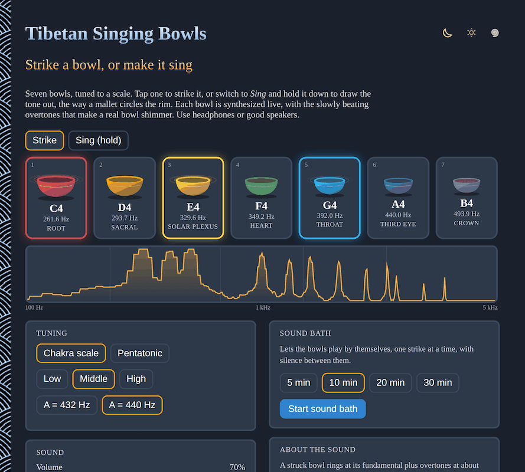

# Tibetan-Singing-Bowls

Play a set of virtual Tibetan singing bowls right in your browser. Strike a bowl, or hold it down to draw the tone out the way a mallet circles the rim. The sound is synthesized live, so there are no audio files to load, and it works offline. Use headphones or good speakers.

- [Play the bowls](https://evoluteur.github.io/tibetan-singing-bowls/)

## What it does

Seven bowls are tuned to a scale, each with its own color. Tap or click a bowl to strike it. Switch to **Sing** and hold a bowl down to make it swell and sustain, then let go to let it fade. The number keys 1 to 7 play the bowls from the keyboard, and you can play several at once.

- **Tuning**: a seven-note chakra scale (C to B, one bowl per chakra) or a pentatonic scale, in the low, middle or high octave, with A at 440 Hz or 432 Hz.
- **Sound**: volume and room reverb.
- **Spectrum**: a live view of the sound, so you can watch the overtones rise and fade.
- **Sound bath**: press start and pick 5, 10, 20 or 30 minutes, and the bowls play by themselves, one strike at a time, with silence in between.

## About the sound

A struck bowl rings at its fundamental plus overtones at about 2.7, 5.2 and 8.3 times that pitch. Those overtones are not whole-number multiples, which is why a bowl sounds like a bell and not like a string. Each partial is made of two sine oscillators a fraction of a hertz apart, so it swells and fades a few times a second: that beating is the "wah-wah" of a real bowl. Higher partials die away faster. The result goes through a synthesized room reverb and a compressor.

This is a model of the sound and not a recording. The bowls are not meant as a medical treatment, and the chakra colors are a common convention, not a measurement.

## How it is built

The pages are plain HTML, CSS and JavaScript with the Web Audio API, with no dependencies and no build step. Just open `index.html`. It is also a small installable web app: add it to your home screen or desktop and it works offline.

- The bowls are drawn as SVG.
- The app logic is in [js/bowls.js](https://github.com/evoluteur/tibetan-singing-bowls/blob/main/js/bowls.js).
- Three color themes (dark, light and blue) are shared with my other projects.
- Your tuning, volume and other settings are kept in the browser's local storage.

## Open Source

Tibetan-Singing-Bowls is open source at [GitHub](https://github.com/evoluteur/tibetan-singing-bowls) with MIT license.

Had fun browsing the app? [Buy me a coffee by becoming a sponsor](https://github.com/sponsors/evoluteur).

You may also be interested in my other sound projects [Healing-Frequencies](https://github.com/evoluteur/healing-frequencies) ([demo](https://evoluteur.github.io/healing-frequencies/)) and [Cymatics](https://github.com/evoluteur/cymatics) ([demo](https://evoluteur.github.io/cymatics/)). For more mystic arts as small web apps, see [Esoterica](https://evoluteur.github.io/projects/esoterica.html).

 [Get a real singing bowl](https://healing-sounds.com/collections/tibetan-singing-bowls?ref=evoluteur)

Copyright (c) 2026 [Olivier Giulieri](https://evoluteur.github.io/).
